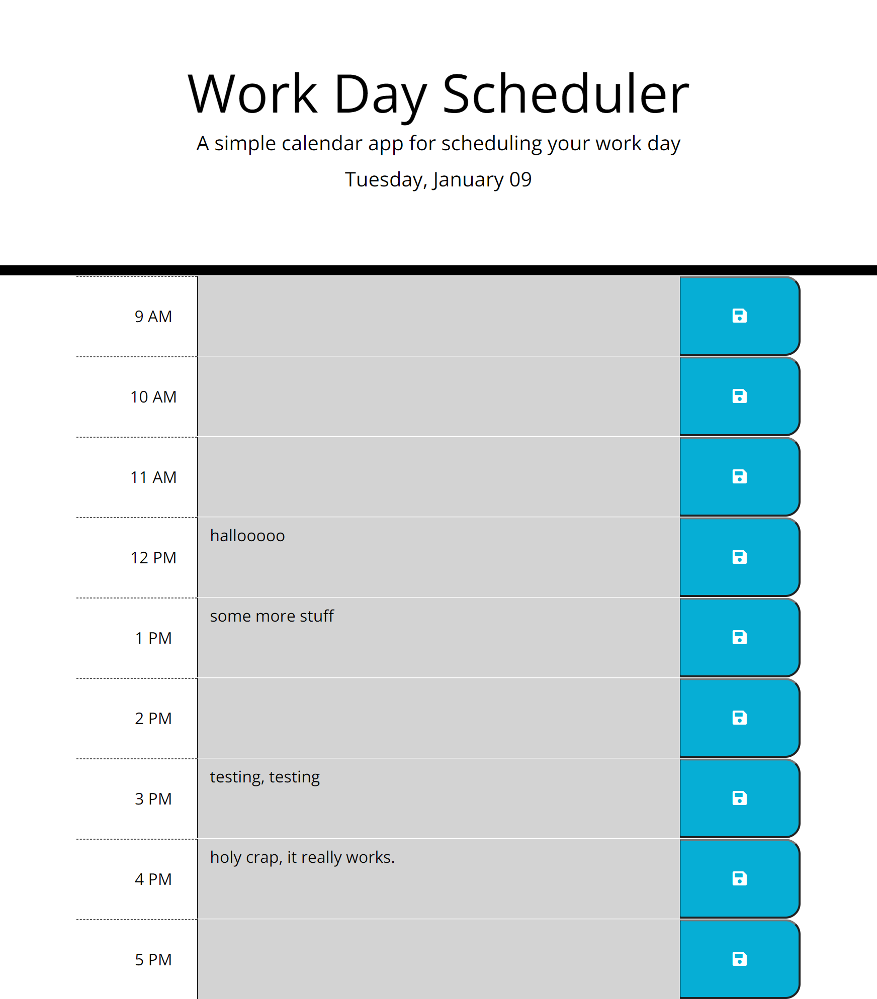
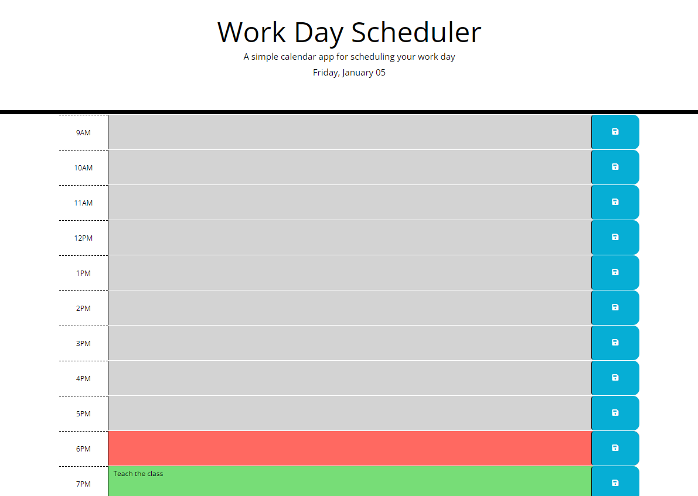

# Workday-Scheduler

EdX Bootcamp Module 7 Assignment - A Calendar App to Schedule Your Workday

## Description

"New Year, new me!" A calendar app to schedule your day and help you get all productive in 2024. (Because a calendar is all it takes!)

## Details

Click on the text area corresponding to the time slot you want to add tasks to, click the save button and what you have entered will be saved in local storage. It will remain there even through page refreshes. There's no escape.

## Shoutout

Had help from Andres Jimenez during my first-ever tutoring session. Thank you Andres for being patient, kind, supportive and knowledgeable!

## Link to Deployed Site:

https://blooshroo.github.io/Workday-Scheduler/

## Screenshots 

Aaron's, to demonstrate colour changes based on time:

